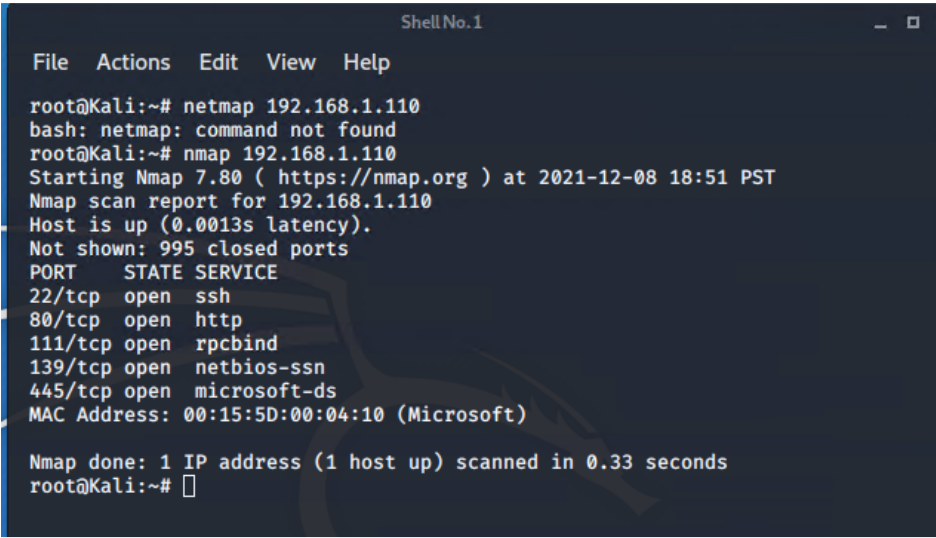

# Red Team: Summary of Operations

## Table of Contents
- Exposed Services
- Critical Vulnerabilities
- Exploitation

### Exposed Services
Fill out the information below._

Nmap scan results for each machine reveal the below services and OS details:

```bash
$ nmap ... nmap 192.168.1.110
```



This scan identifies the services below as potential points of entry:
- Target 1
  - List of
  - Exposed Services

Fill out the list below. Include severity, and CVE numbers, if possible._

The following vulnerabilities were identified on each target:
- Target 1
  - 22/tcp open ssh
  - 80/tcp open http
  - 111/tcp open rpcbind
  - 139/tcp open netbios-ssn
  - 445/tcp open microsoft-ds


 
### Exploitation
Fill out the details below. Include screenshots where possible._

The Red Team was able to penetrate `Target 1` and retrieve the following confidential data:
- Target 1
  - `flag1.txt`: 
    - **Exploit Used**
        - Sensitive data found on the website page
        - http://192.168.1.110/services 
  - `flag2.txt`: 
    - **Exploit Used**
      - wordpress enumerate
      - wpscan --url http://192.168.1.110/wordpress --enumerate u
   - `flag3.txt`: 
    - **Exploit Used**
        - password guessing
        - ssh michael@192.168.1.110
        - guessed his password which was michael 
  - `flag4.txt`: 
    - **Exploit Used**
      - Crack md5hash using John
      - then use python script to gain root access
      - ssh steven@192.168.1.110
      - sudo python -c 'import pty; pty.spawn("/bin/bash")'  
  
